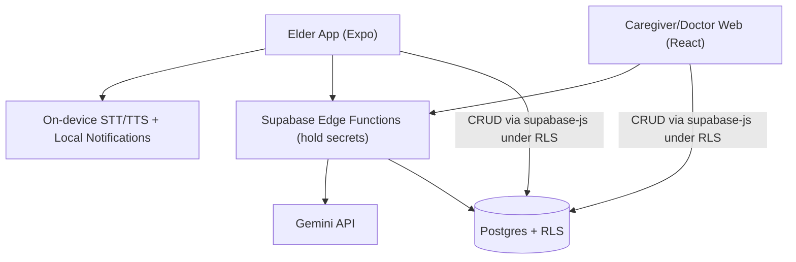
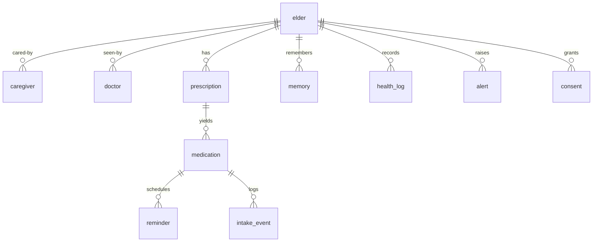

# Architecture Spine — AI Health Companion

## Design Paradigm

**Client–BaaS with a serverless AI-gateway.** Three thin client surfaces sit over one managed backend; no client owns authoritative state, and no client holds a secret or calls a third-party AI directly.

- **Clients:** `app/` = Expo elder voice app (React Native); `web/` = one role-routed React app serving both the caregiver and doctor dashboards.
- **Backend (Supabase):** Postgres + Auth + Storage + Row-Level Security = the shared spine; **Edge Functions** = the only place secrets live and the only path for AI or rule-bearing writes.
- **The hero is a pipeline** (pipes-and-filters): `capture → parse → verify (the gate) → schedule`. Each stage is a discrete step writing its result to the datastore; the gate is a hard break between "parsed" and "live."

## Invariants & Rules

The durable calls a future builder cannot read off compliant code. IDs are stable and never renumbered. `[ADOPTED]` = already settled by the PRD locks or the solution architecture.

**Allowed dependency directions** (a client may never reach Gemini directly):



### AD-1 — Single shared datastore is the source of truth `[ADOPTED]`
- **Binds:** all surfaces
- **Prevents:** per-surface divergent data models / sync bugs
- **Rule:** the `elder` record is the hub; every entity FKs to it; no client persists its own authoritative copy of shared state.

### AD-2 — Secrets and AI calls only server-side `[ADOPTED]`
- **Binds:** elder app, web, all AI usage
- **Prevents:** the Gemini key leaking in a shipped bundle; clients coupling directly to Gemini
- **Rule:** clients call the project's own Edge Functions; only Edge Functions hold API keys and call Gemini or any third party.

### AD-3 — The confirmation gate is enforced in data, not UI `[ADOPTED]`
- **Binds:** hero (FR5–9), reminders (FR13), safety (NFR2)
- **Prevents:** an unverified prescription becoming a live reminder (DC-3)
- **Rule:** a `reminder` row is creatable only when its `medication.confirmed = true`, enforced by a DB trigger; `confirmed` defaults `false`; only a linked caregiver or the elder may flip it.

### AD-4 — Pill appearance is human-confirmed data, never model output `[ADOPTED]`
- **Binds:** hero (FR7, FR11)
- **Prevents:** model-guessed pill identity on the highest-stakes field (DC-3)
- **Rule:** `medication.appearance` / `appearance_photo_url` are written only via the caregiver onboarding capture path; the Rx-parse Edge Function must never write appearance.

### AD-5 — Voice I/O runs on-device; only reasoning crosses the network `[ADOPTED]`
- **Binds:** elder app conversation (FR18), latency (NFR5), cost
- **Prevents:** per-minute cloud-voice cost and latency blowout
- **Rule:** STT/TTS sit behind a swappable `voice` interface, default on-device (`expo-speech` / `expo-speech-recognition`); the network payload is text (fallback: a single audio→Gemini call). Swapping the provider must not change callers.

### AD-6 — Schema-validated structured output for safety-bearing AI `[ADOPTED]`
- **Binds:** Rx parse (FR6, FR8), passive-log significance (FR25)
- **Prevents:** brittle free-text parsing → a silent wrong dose (NFR2)
- **Rule:** any safety-bearing Gemini call declares a `responseSchema` and returns a per-field confidence; a low-confidence field is flagged for human review, never auto-accepted.

### AD-7 — Role-scoped access via Row-Level Security at the database `[ADOPTED]`
- **Binds:** all surfaces, consent (FR3, FR42)
- **Prevents:** one caregiver/doctor reading another elder's data; UI-only auth bugs
- **Rule:** every table carries RLS policies keyed on the linked `elder` + role; the doctor role is read-only and consent-gated; UI routing is not the security boundary.

### AD-8 — Reminders fire from on-device local scheduling `[ADOPTED]`
- **Binds:** reminders (FR13), reliability (NFR10)
- **Prevents:** missed doses under flaky/no connectivity; dependence on push infrastructure
- **Rule:** a confirmed medication generates **local** scheduled notifications on the device (`expo-notifications`); the server is not in the firing path.

### AD-9 — "No clinical judgement" is an architectural constraint, not just copy
- **Binds:** conversation (FR20), safety (FR28, FR29)
- **Prevents:** model-driven triage or diagnosis (DC-1, DC-2)
- **Rule:** red-flag detection is a deterministic keyword gate that runs **before** the model and returns a fixed response; the model is never the decider of medical safety; the conversation Edge Function's system prompt encodes the locks.

### AD-10 — Memory retrieval is a structured query, not vector RAG, in v1
- **Binds:** memory / retention (FR19, FR21)
- **Prevents:** over-engineering a vector store; unpredictable retrieval
- **Rule:** memory queries are answered by a typed SQL query over the `memory` table (by `type` + recency + keyword); `pgvector` is deferred (see Deferred).

### AD-11 — Store extracted facts, not raw audio
- **Binds:** all logging, privacy (NFR6)
- **Prevents:** sensitive raw-audio retention / PDPA exposure
- **Rule:** no table stores audio; only transcripts/extractions persist; audio buffers are discarded after processing.

## Consistency Conventions

| Concern | Convention |
| --- | --- |
| Naming | `snake_case` tables/columns; `camelCase` TS/JS; entity ids `uuid` (`gen_random_uuid()`); Edge Function names kebab-case (`parse-rx`, `converse`, `translate`). |
| Data & formats | timestamps `timestamptz` in UTC; language codes `'en'` / `'ms'`; confidence a `numeric` in `0..1`; Edge Function error shape `{ "error": { "code", "message" } }`. |
| State & cross-cutting | rule-bearing writes (parse, confirm→reminder, alerts) go **through Edge Functions**; plain reads/CRUD via `supabase-js` under RLS; secrets only in Edge Function env; auth = Supabase Auth; audio is ephemeral (AD-11). |

## Stack

Seed — verified current 2026-07-14; the code owns this once it exists.

| Name | Version |
| --- | --- |
| Expo SDK (React Native 0.86) | 57 |
| React (web + RN) | 19.2 |
| Node.js (tooling) | 22 LTS |
| Vite (web build) | current |
| supabase-js | v2 |
| Supabase (Postgres + Edge Functions/Deno + Auth + Storage) | managed |
| Gemini model | `gemini-2.5-flash` (`gemini-2.5-flash-lite` = cheaper alt) |
| Gemini SDK | `@google/genai` |
| Expo modules | `expo-speech`, `expo-speech-recognition`, `expo-notifications`, `expo-audio` |
| Web hosting | Vercel (free) |

## Structural Seed

**Core entities** (names + relationships; attribute-level invariants live in the ADs):



**Source tree** (scaffold, not a mirror):

```text
health-companion/
  app/            # Expo elder voice app (React Native)
    voice/        # swappable STT/TTS interface (AD-5)
  web/            # React (Vite) dashboards, role-routed: caregiver + doctor
  supabase/
    migrations/   # schema + RLS policies + the reminder gate trigger (AD-3, AD-7)
    functions/    # Edge Functions: parse-rx, converse, translate (hold Gemini key, AD-2)
```

**Deployment & environments (pilot-grade):** one Supabase project (no separate staging), `web/` on Vercel free tier, `app/` shipped as an EAS-built APK sideloaded to pilot phones. A staging/prod split, CI/CD, and formal observability are deferred (see Deferred) — for the pilot, the Supabase dashboard + Expo/EAS logs are the operational surface.

## Capability → Architecture Map

| Capability / Area (PRD) | Lives in | Governed by |
| --- | --- | --- |
| Onboarding & accounts (FR1–3) | `web/` (caregiver) + `supabase/` Auth | AD-1, AD-7 |
| Hero: Rx → confirmed schedule (FR5–9, FR11) | `supabase/functions/parse-rx` + `web/` confirm screen | AD-2, AD-3, AD-4, AD-6 |
| Reminders (FR13–15) | `app/` (local notifications) + `intake_event` | AD-3, AD-8 |
| Voice companion & memory (FR18–21) | `app/voice/` + `supabase/functions/converse` + `memory` | AD-2, AD-5, AD-9, AD-10 |
| Passive logging (FR24–26) | `supabase/functions/converse` → `health_log` | AD-6, AD-9, AD-11 |
| Safety floor (FR28–30) | `supabase/functions/converse` keyword gate → `alert` | AD-9 |
| Caregiver surface (FR34) | `web/` (caregiver role) | AD-1, AD-7 |
| Doctor dashboard (FR39–41) | `web/` (doctor role, read-only) | AD-7 |

## Deferred

- **Deferred FRs (PRD §11)** — pharmacist share, translation back-validation, silence escalation, adaptive cadence, alert-delivery infra (FR36), export/deletion, etc. Out of scope for this spine.
- **`pgvector` semantic memory** (revisit AD-10) — only if structured retrieval proves insufficient in the pilot.
- **Off-dashboard alert delivery** (web push + email/SMS) — infra deferred with FR36.
- **Staging/prod split, CI/CD, formal observability/monitoring** — pilot runs on one environment; revisit when moving past the FYP pilot.
- **iOS ship target, multi-elder scaling, second caregiver roles** — Future Plans.
- **National pill-appearance data source (NPRA Quest3+)** — pilot uses caregiver-captured appearance (AD-4); national source is a post-pilot data question (OQ-3).
